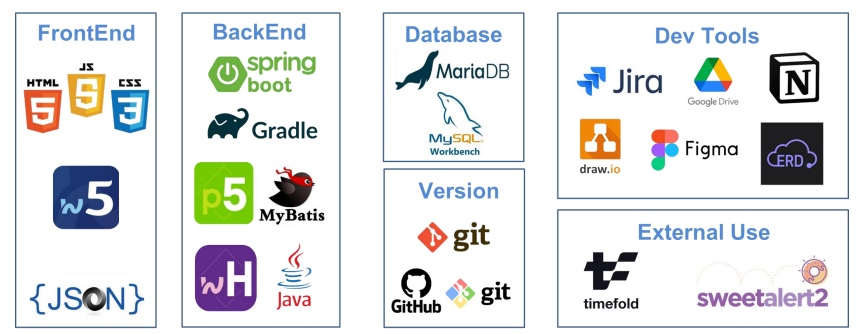
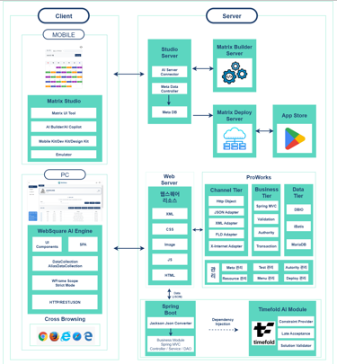
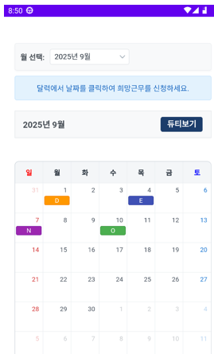
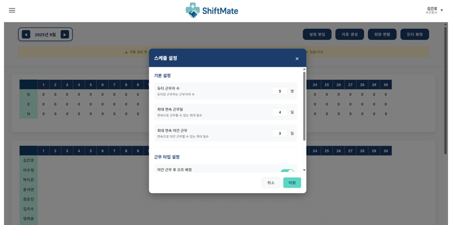
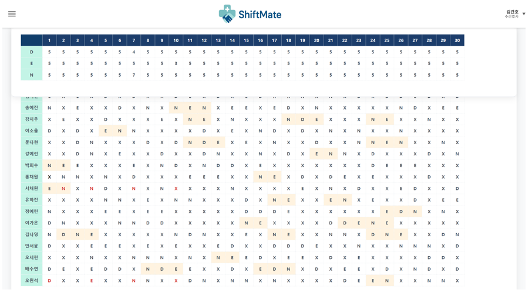

# ShiftMate
> AI 기반 간호사 교대 근무 자동 듀티 스케줄링 시스템

---
## 팀명
### "404조 NOT FOUND"
**기존엔 존재하지 않던, 아무도 못 만든 시스템을 우리가 찾아내고 구현했다!**

---

## 팀원 소개
|이름|직책|역할|
|---------|---------|-----|
|오원석|팀장|수간호사(웹)에서 근무자 관리, 내 스케줄 보기, 희망 근무 입력을 가능하게 한다.|
|김민식|팀원|TimeFold AI 서버 구축 후 스케줄 관리 시 자동 생성 및 희망 현황 반영 후 수동으로 수정 가능하게 한다.|
|최승준|팀원|간호사(모바일)에서 내 스케줄 보기, 희망 근무 입력을 가능하게 한다.|

---

## 프로젝트 소개

**ShiftMate**는 병원 간호사의 교대 근무표(듀티)를 자동으로 생성해주는 AI 기반의 스케줄링 시스템입니다. Timefold 최적화 엔진을 활용하여 병원의 다양한 제약 조건을 고려한 **효율적인 근무 배정**을 가능하게 하며, 실무자의 의견을 반영한 **현장 중심 설계**가 특징입니다.

---

## 개발 목적

- 간호사 스케줄 편성의 **복잡성 해소**
- 수작업으로 진행되던 근무표 작성의 **자동화**
- 병원마다 상이한 **제약조건 유연 반영**
- 의료진의 **업무환경 개선** 및 **환자 서비스 질 향상**

---
## Q&A
“간호사도 직접 듀티 짜나요?”
> 예, 실무 적응을 위해 학생 때부터 작성하며, 실제로 수간호사 외에도 다양한 인원이 스케줄 편성에 참여합니다.

“병원마다 시스템 통일이 어려운가요?”
> 병동 수, 근무자 수, 유연근무제 등 조건이 너무 달라 통합 시스템이 부족한 현실입니다. ShiftMate는 이 문제를 해결하고자 합니다.

---
## 핵심 기능

-  **자동 스케줄 생성**  
  Timefold 기반 최적화로 3교대 근무표 자동 생성  

-  **희망 근무 반영**  
  간호사의 희망 근무 요청 반영  

-  **수간호사 기능**  
  간호사 등록, 근무자 관리, 스케줄 확정  

-  **일정 공유 및 조회**  
  생성된 듀티를 실시간으로 조회 및 공유 가능  

---
## 기술 스택

---
## 아키텍처

---
## UI/UX 중요 페이지 스크린샷

### 간호사 화면
#### 희망근무 신청

### 수간호사 화면
#### 제약 조건 설정(Hard(기본 설정)/Soft(근무 타입 설정))

#### 스케줄 관리(자동생성 -> 희망근무반영(빨간색 텍스트) -> 수동 조정)

---
## Timefold 최적화 결과 예시

* 다양한 제약조건 하에서 최적 스케줄을 도출하는 데 걸리는 시간 시각화

* 응답 시간 30초 이내로 설정해 현실적인 사용성을 고려

---
## 실무자 설문 기반 개선

* 간호사 대상 설문조사 (아산/삼성 병원 등 17명)

* 기존 앱 '마이듀티'의 불편함 보완

* 실습 시 듀티 작성 경험 반영

---
## 향후 개선사항

* 다양한 병원/기업 환경에 적용 가능한 제약조건 유연성 확보

* 구글/네이버 캘린더 툴과의 연동

* 스케줄 + 공간 정보 통합 공유

* 근무 이력 36개월 장기 저장 기능
